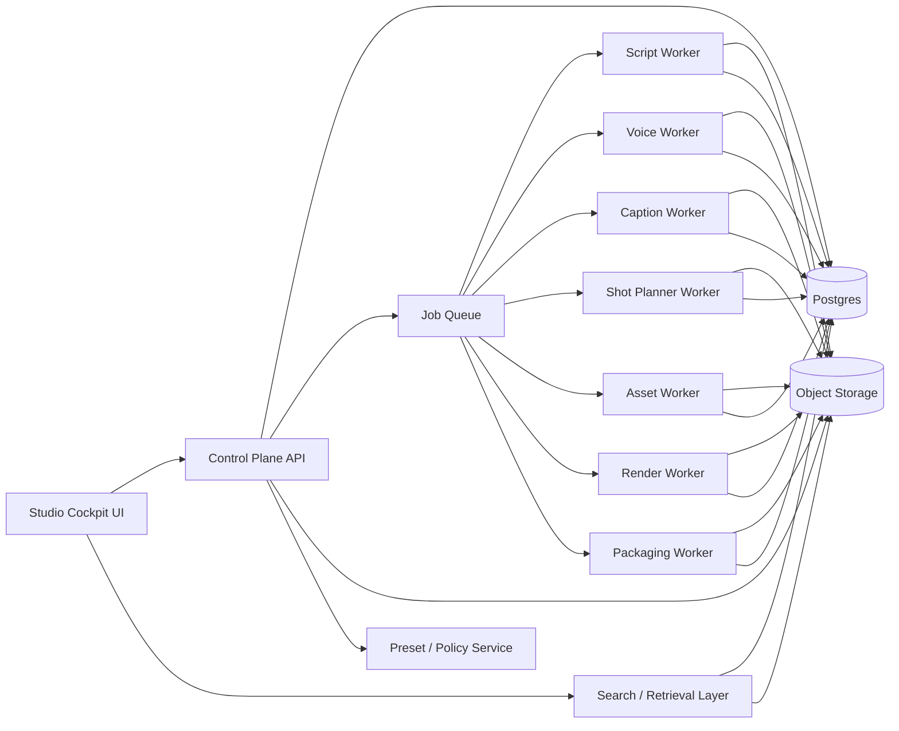

# YouTube Studio Architecture

## Planning Assumptions

- The current repository is still being initialized from a spec-first starting point.
- The first implementation must ship one strong production lane.
- The long-term product should become a tool-rich studio cockpit, not just a hidden job runner.
- Ease of use is a product requirement, not a cosmetic follow-up.

## Architectural Goal

Build the narrowest reliable end-to-end system that can move an approved brief through script, voice, captions, assets, render, review, and packaging while preserving a clean upgrade path into a more powerful studio operating system.

## Product Shape

The architecture should support two truths at once:

1. The MVP is a narrow, reliable production lane.
2. The product vision is a broader cockpit with many operator tools.

That means the system should be modular from day one even if it ships as a modular monolith.

## System Shape

## Major Subsystems

### 1. Studio Cockpit UI

Owns:

- run creation
- review checkpoints
- artifact previews
- compare-and-regenerate flows
- diagnostics and failure explanations
- library, preset, and package browsing

This must feel operator-first:

- the next action is obvious
- advanced tools are available without cluttering the default path
- failures are explained in product language, not infrastructure language

### 2. Control Plane

Owns:

- run creation
- brief validation
- review transitions
- stage scheduling
- retry orchestration
- run ledger and state history
- rejection reason capture
- permission checks

Does not own:

- provider-specific generation logic
- frame-level editing
- ad hoc manual asset manipulation

### 3. Pipeline Workers

Own:

- script generation
- voice generation
- caption timing
- shot planning
- asset generation
- render and packaging

Each worker should:

- consume immutable inputs
- emit immutable outputs
- write rich execution metadata
- support retry without corrupting upstream work

### 4. Artifact Storage

Stores:

- briefs
- fact maps
- scripts
- voice outputs
- captions
- shot plans
- generated assets
- final renders
- publish packages
- review snapshots

Rules:

- artifacts are immutable
- retries create new versions
- all important outputs are previewable in the UI
- metadata must be sufficient for rerender and reuse

### 5. Search / Retrieval Layer

Owns:

- previous runs
- reusable patterns
- fact-pack recall
- asset reuse lookup
- title / thumbnail / hook reuse

This is essential for a powerful studio product because users should be able to:

- search for previous successful runs
- reuse pieces instead of regenerating everything
- learn from prior approval and rejection decisions

### 6. Preset / Policy Layer

Owns:

- channel presets
- tone presets
- voice presets
- banned-claim rules
- review policy
- cost ceilings
- fallback provider policy

This is how the product stays easy to use even as it gains power.

## Recommended Data Model

Core tables or collections:

- `runs`
- `briefs`
- `fact_maps`
- `review_events`
- `stage_executions`
- `artifacts`
- `providers`
- `cost_ledger`
- `presets`
- `asset_library`
- `packaging_variants`

Key enums:

- `run_status`: draft, awaiting_brief_review, awaiting_script_review, running, awaiting_final_review, approved, rejected, failed
- `stage_name`: brief, script, voice, captions, shot_plan, assets, render, packaging
- `failure_code`: validation_error, provider_error, timeout, unsafe_output, quality_rejection, render_error
- `rejection_reason`: factual_issue, weak_hook, poor_narration, poor_visual_alignment, caption_problem, pacing_problem, render_defect, policy_issue

## UI Architecture Requirements

### Run Workspace

The main run page should combine:

- current stage
- artifact preview
- history of retries and versions
- approval controls
- cost and latency summary
- failure explanation

### Tool Panels

Tooling should be grouped rather than scattered:

- Brief tools
- Script tools
- Voice tools
- Visual tools
- Packaging tools
- Diagnostics tools

### Progressive Disclosure

The default path should stay simple:

- create run
- approve brief
- approve script
- approve final cut

Advanced tools should be one click away, not one screen away.

## Service Boundaries

### Control Plane API

Contracts:

- accepts operator input
- persists state transitions
- dispatches stage work
- authorizes review actions
- exposes artifacts and telemetry

### Worker Runtime

Contracts:

- pulls versioned stage payloads from the queue
- emits immutable artifacts
- writes execution metadata
- never mutates upstream outputs

### Provider Adapter Layer

Contracts:

- isolate LLM, TTS, image, and render provider specifics
- normalize provider errors into platform failure codes
- support fallback without changing orchestration logic
- allow targeted stage reruns

### Retrieval Layer

Contracts:

- index reusable artifacts and metadata
- return relevant prior runs, presets, and patterns
- help the operator avoid unnecessary reruns and rework

## Integration Points

- LLM provider for brief normalization and script generation
- TTS provider for narration
- caption timing engine or ASR alignment pass
- image or motion-generation provider for visuals
- FFmpeg-based render pipeline
- packaging layer for title, description, hashtags, thumbnail candidates, and export bundle
- optional future publishing adapter

## Recommended MVP Stack

- `Next.js` plus `TypeScript` for the studio cockpit and control plane
- `Postgres` for state, runs, reviews, and telemetry
- `Redis`-backed queue for stage scheduling and retries
- `S3-compatible object storage` for artifacts
- `FFmpeg` for render and assembly
- provider adapters behind stable internal interfaces

## Build Order

1. app shell, design primitives, and run model
2. brief and script review lane
3. voice and caption lane
4. shot plan and asset lane
5. render and packaging lane
6. diagnostics and compare/regenerate tools
7. presets and reusable library
8. analytics and performance learning

## Primary Risks

- weak factual grounding reaching final review
- asset generation cost dominating economics
- render reliability collapsing without stage caching
- provider variance breaking output consistency
- UI complexity growing faster than operator clarity
- search / library features being bolted on too late

## Architectural Principle

The product should become more powerful by accumulating structured capabilities, not by becoming harder to operate.

If a feature adds power but makes the happy path harder to understand, it belongs behind an advanced tool boundary.
